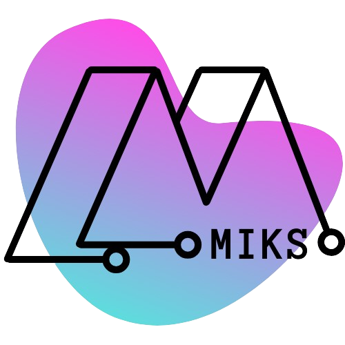

# Portfolio

<p align=center>
  
</p>

>  **Autora:** Mariana Izumi Kuroshima da Silva

<hr>

<p align=center>
  <a href="#executar">Executar</a> |
  <a href="#planejamento">Planejamento</a>
</p>

<h3 align=center>
  <a href="https://developer.mozilla.org/pt-BR/docs/Web/Guide/HTML/HTML5"></a>
  <a href="https://developer.mozilla.org/pt-BR/docs/Web/CSS"></a>
  <a href=""></a>
  <a href="https://flask.palletsprojects.com/"></a>
</h2>


Este projeto foi realizado nas aulas de Design Digital para demonstrar um pouco sobre mim. Implementar o que sei fazer até agora em questão de Front-End e também proporcionar novos desafios.

# Execução <a id="executar"></a>

## Entrar pelo link:
<a href="https://portfolio-marianaizumi.vercel.app/">Link para acessar o portfolio</a>


## Localmente:
Para conseguir rodar este portfolio na sua máquina local, é preciso seguir os seguintes passos:

1. Baixar a `tag` da última versão disponibilizada no repositório
  
2. Criar e configurar o ambiente virtual dentro da pasta criada pelo arquivo *.zip*. Para isso, siga os comandos disponibilizados abaixo:
   ```
    #criar ambiente
    py -m venv venv

    #ativa-lo
    .\venv\Scripts\activate

    #instalar os recursos necessários
    pip install -r requirements.txt

   ```

3. Finalmente, para rodar o sistema, é necessário entrar na pasta `src` e digitar o comando:
   ```
   flask run
   ```

# Planejamento <a id="planejamento"></a>
Para o desenvolvimento, foi proposto pequenas entregas ao longo do semestre para conseguir ter um certo acompanhamento.

## Entrega 1
Nesta primeira entrega foi proposto o desenvolvimento de um protótipo navegável e um wireframe para mobile e desktop.

- Wireframe realizado no Figma: este <a href="doc/wireframe-portfolio.pdf"> arquivo pdf </a> é o wireframe onde os códigos do meu portfólio foram baseados. Toda a arte foi de minha autoria, as imagens da internet serão creditadas no código.


### Organização das pastas
1. **doc**
  - *wireframe-portfolio*
2. **src**
  - *img:* pasta onde se localiza todas as imagens utilizadas na página
  - *layout:* pasta dos arquivos .css do projeto
  - *templates:* pasta dos arquivos .html do projeto

## Entrega 2
Para esta entrega, foi feito a navegabilidade com o Flask e terminar de estruturar o site, com responsabilidade e todos os atributos propostos no wireframe.

## Entrega 3
Subindo o portfolio para o heroku